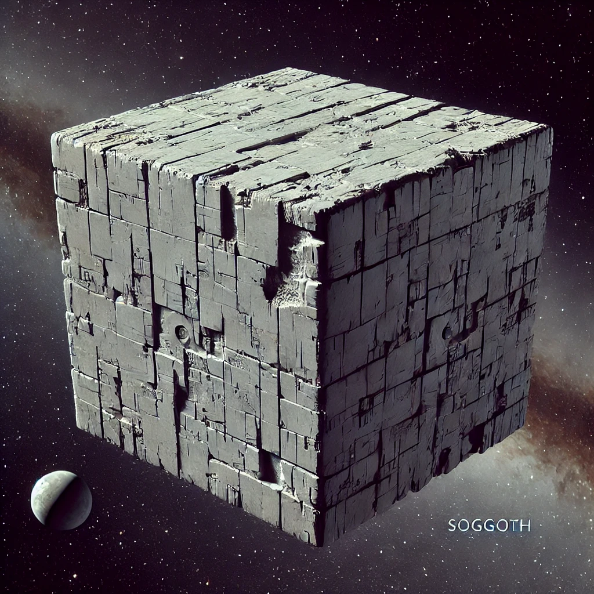
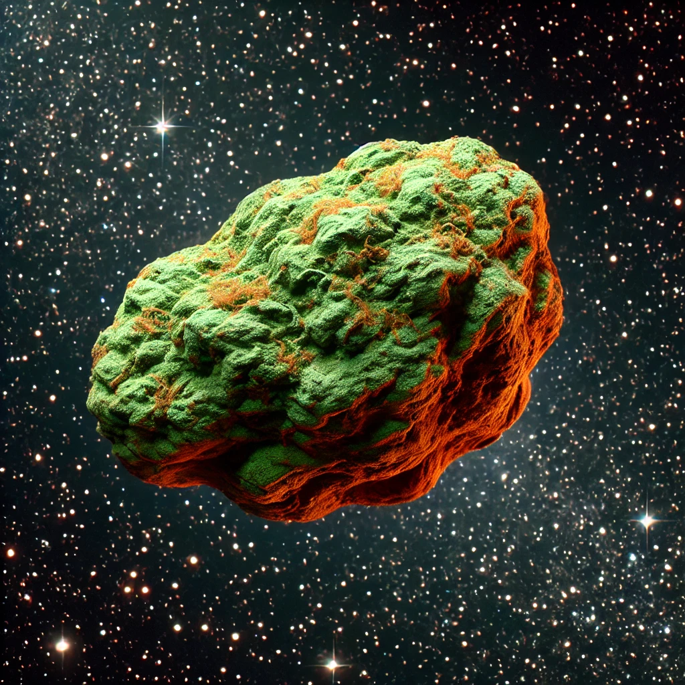

# KSPDynosSystem ("Dynos")

Welcome to the KSPDynosSystem, a Kerbal Space Program planet pack mod that introduces a distant star system colonized by an ancient, advanced civilization. The central star, Dynos, is a pulsar surrounded by the remnants of a Dyson sphere. Explore new celestial bodies, each with unique characteristics and histories.

## Features

- **Central Star: Dynos**
  - A pulsar with a fragmented Dyson sphere.
  - Warm light and pulsating orange glow.
  - Rings extending to include Dyson fragments.

## Planets and Moons

<table>
<tr>
<td>
    <h3>Cryon</h3>
  <dl>
    <dt><strong>Description</strong></dt><dd>A serene, icy world believed to be the birthplace of the Builders.</dd>
    <dt><strong>Radius</strong></dt><dd>600,000 m</dd>
    <dt><strong>Mass</strong></dt><dd>1.2e23 kg</dd>
    <dt><strong>Surface Gravity</strong></dt><dd>0.9 g</dd>
    <dt><strong>Rotation Period</strong></dt><dd>72,000 s</dd>
  </dl>
</td>
<td></td>
</tr>
</table>

#### Moons of Cryon

<table>
<tr>
<td>
    <h5>Mirroo</h5>
  <dl>
    <dt><strong>Description</strong></dt><dd>A jagged, reflective ice moon resembling a second star.</dd>
    <dt><strong>Radius</strong></dt><dd>60,000 m</dd>
    <dt><strong>Mass</strong></dt><dd>1.8e20 kg</dd>
    <dt><strong>Surface Gravity</strong></dt><dd>0.03 g</dd>
    <dt><strong>Rotation Period</strong></dt><dd>20,000 s</dd>
  </dl>
</td>
<td></td>
</tr>
</table>

<table>
<tr>
<td>
    <h5>Terroo</h5>
  <dl>
    <dt><strong>Description</strong></dt><dd>A chaotic moon with rapidly shifting terrain and rumored subterranean oceans.</dd>
    <dt><strong>Radius</strong></dt><dd>50,000 m</dd>
    <dt><strong>Mass</strong></dt><dd>1.0e20 kg</dd>
    <dt><strong>Surface Gravity</strong></dt><dd>0.02 g</dd>
    <dt><strong>Rotation Period</strong></dt><dd>50,000 s</dd>
  </dl>
</td>
<td></td>
</tr>
</table>

<table>
<tr>
<td>
    <h5>Slippy</h5>
  <dl>
    <dt><strong>Description</strong></dt><dd>A smooth, icy moon with a frictionless surface.</dd>
    <dt><strong>Radius</strong></dt><dd>30,000 m</dd>
    <dt><strong>Mass</strong></dt><dd>7.0e19 kg</dd>
    <dt><strong>Surface Gravity</strong></dt><dd>0.01 g</dd>
    <dt><strong>Rotation Period</strong></dt><dd>15,000 s</dd>
  </dl>
</td>
<td></td>
</tr>
</table>

<table>
<tr>
<td>
    <h3>Chromos</h3>
  <dl>
    <dt><strong>Description</strong></dt><dd>A massive gas giant with pastel bands and bioluminescent organisms.</dd>
    <dt><strong>Radius</strong></dt><dd>7,000,000 m</dd>
    <dt><strong>Mass</strong></dt><dd>4.0e27 kg</dd>
    <dt><strong>Surface Gravity</strong></dt><dd>2.4 g</dd>
    <dt><strong>Rotation Period</strong></dt><dd>36,000 s</dd>
  </dl>
</td>
<td></td>
</tr>
</table>

#### Moons of Chromos

<table>
<tr>
<td>
    <h5>Pyramyd</h5>
  <dl>
    <dt><strong>Description</strong></dt><dd>A pyramid-shaped asteroid with glyph-covered surfaces.</dd>
    <dt><strong>Radius</strong></dt><dd>100,000 m</dd>
    <dt><strong>Mass</strong></dt><dd>5.0e20 kg</dd>
    <dt><strong>Surface Gravity</strong></dt><dd>0.02 g</dd>
    <dt><strong>Rotation Period</strong></dt><dd>20,000 s</dd>
  </dl>
</td>
<td></td>
</tr>
</table>

<table>
<tr>
<td>
    <h5>Onut</h5>
  <dl>
    <dt><strong>Description</strong></dt><dd>A donut-shaped moon with a glowing hollow center.</dd>
    <dt><strong>Radius</strong></dt><dd>60,000 m</dd>
    <dt><strong>Mass</strong></dt><dd>5.0e19 kg</dd>
    <dt><strong>Surface Gravity</strong></dt><dd>0.001 g</dd>
    <dt><strong>Rotation Period</strong></dt><dd>40,000 s</dd>
  </dl>
</td>
<td></td>
</tr>
</table>

<table>
<tr>
<td>
    <h5>Luminee</h5>
  <dl>
    <dt><strong>Description</strong></dt><dd>A glowing, neon-green moon with a radioactive halo.</dd>
    <dt><strong>Radius</strong></dt><dd>400,000 m</dd>
    <dt><strong>Mass</strong></dt><dd>2.0e22 kg</dd>
    <dt><strong>Surface Gravity</strong></dt><dd>0.2 g</dd>
    <dt><strong>Rotation Period</strong></dt><dd>60,000 s</dd>
  </dl>
</td>
<td></td>
</tr>
</table>

<table>
<tr>
<td>
    <h5>Jelloo</h5>
  <dl>
    <dt><strong>Description</strong></dt><dd>A jelly-like, translucent moon that wobbles as it orbits.</dd>
    <dt><strong>Radius</strong></dt><dd>30,000 m</dd>
    <dt><strong>Mass</strong></dt><dd>5.0e19 kg</dd>
    <dt><strong>Surface Gravity</strong></dt><dd>0.01 g</dd>
    <dt><strong>Rotation Period</strong></dt><dd>15,000 s</dd>
  </dl>
</td>
<td></td>
</tr>
</table>

<table>
<tr>
<td>
    <h5>Jagga</h5>
  <dl>
    <dt><strong>Description</strong></dt><dd>A jagged moon with towering spires and glowing craters.</dd>
    <dt><strong>Radius</strong></dt><dd>50,000 m</dd>
    <dt><strong>Mass</strong></dt><dd>1.0e20 kg</dd>
    <dt><strong>Surface Gravity</strong></dt><dd>0.02 g</dd>
    <dt><strong>Rotation Period</strong></dt><dd>30,000 s</dd>
  </dl>
</td>
<td></td>
</tr>
</table>

<table>
<tr>
<td>
    <h3>Swampora</h3>
  <dl>
    <dt><strong>Description</strong></dt><dd>A lush, swampy world with bioluminescent vegetation and terraforming remnants.</dd>
    <dt><strong>Radius</strong></dt><dd>800,000 m</dd>
    <dt><strong>Mass</strong></dt><dd>4.5e22 kg</dd>
    <dt><strong>Surface Gravity</strong></dt><dd>0.8 g</dd>
    <dt><strong>Rotation Period</strong></dt><dd>5,400 s</dd>
  </dl>
</td>
<td></td>
</tr>
</table>

#### Moons of Swampora

<table>
<tr>
<td>
    <h5>Infernoo</h5>
  <dl>
    <dt><strong>Description</strong></dt><dd>A fiery volcanic moon orbiting Swampora, ripped apart by tidal forces from both Swampora and Dynos. Its surface glows with rivers of lava, and the air shimmers with heat and sulfurous gas.</dd>
    <dt><strong>Radius</strong></dt><dd>50,000 m</dd>
    <dt><strong>Mass</strong></dt><dd>1.5e21 kg</dd>
    <dt><strong>Surface Gravity</strong></dt><dd>0.12 g</dd>
    <dt><strong>Rotation Period</strong></dt><dd>30,000 s</dd>
  </dl>
</td>
<td></td>
</tr>
</table>

<table>
<tr>
<td>
    <h5>Chonk</h5>
  <dl>
    <dt><strong>Description</strong></dt><dd>A cube-shaped moon with sharp edges and flat surfaces.</dd>
    <dt><strong>Radius</strong></dt><dd>40,000 m</dd>
    <dt><strong>Mass</strong></dt><dd>9.0e19 kg</dd>
    <dt><strong>Surface Gravity</strong></dt><dd>0.03 g</dd>
    <dt><strong>Rotation Period</strong></dt><dd>30,000 s</dd>
  </dl>
</td>
<td></td>
</tr>
</table>

<table>
<tr>
<td>
    <h3>Buddy</h5>
  <dl>
    <dt><strong>Description</strong></dt><dd>A peculiar interstellar object with faint signals.</dd>
    <dt><strong>Radius</strong></dt><dd>25,000 m</dd>
    <dt><strong>Mass</strong></dt><dd>2.0e19 kg</dd>
    <dt><strong>Surface Gravity</strong></dt><dd>0.005 g</dd>
    <dt><strong>Rotation Period</strong></dt><dd>100,000 s</dd>
  </dl>
</td>
<td></td>
</tr>
</table>

## Installation

1. Download the latest release from the [GitHub repository](https://github.com/your-repo/KSPDynosSystem).
2. Extract the contents of the zip file into your KSP `GameData` directory.
3. Ensure you have the required dependencies installed:
   - Kopernicus
   - ModuleManager

## License

This mod is licensed under the MIT License. See the [LICENSE](LICENSE) file for more details.

## Credits

- **Mod Author**: [Your Name]
- **Special Thanks**: To the KSP modding community for their support and inspiration.

## Feedback and Support

For feedback, support, or to report issues, please visit the [GitHub Issues](https://github.com/your-repo/KSPDynosSystem/issues) page.

Happy exploring!